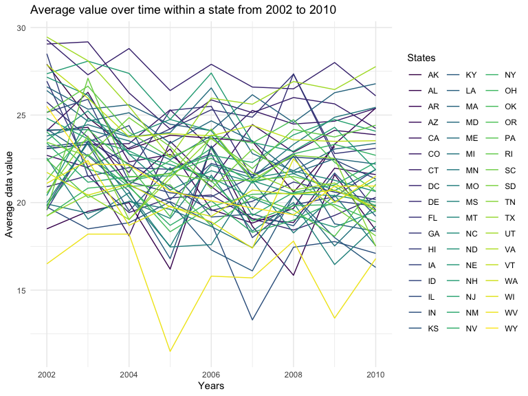
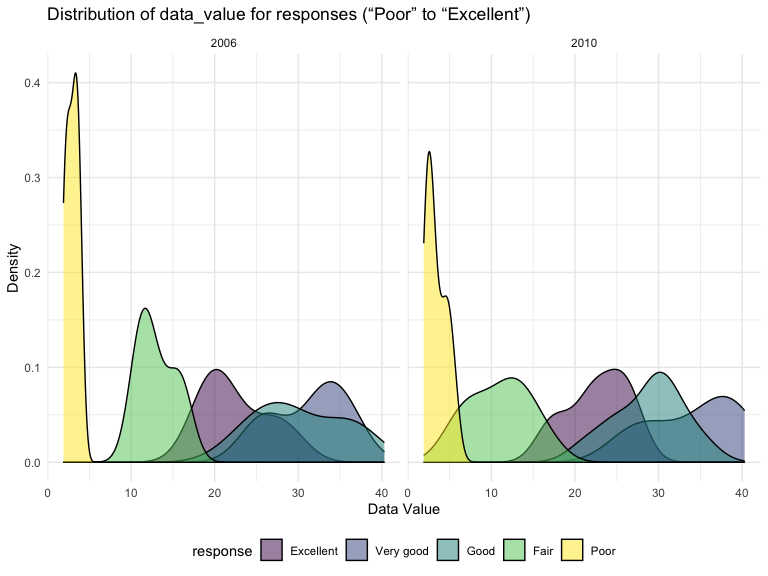

Homework 3
================
Melike Aksoy
2023-10-14

### Loading the libraries including library for p8105.datasets

``` r
library(tidyverse)
library(ggridges)
library(patchwork)
library(p8105.datasets)

knitr::opts_chunk$set(
    echo = TRUE,
    warning = FALSE,
    fig.width = 8, 
  fig.height = 6,
  out.width = "90%"
)

theme_set(theme_minimal() + theme(legend.position = "bottom"))

options(
  ggplot2.continuous.colour = "viridis",
  ggplot2.continuous.fill = "viridis"
)

scale_colour_discrete = scale_colour_viridis_d
scale_fill_discrete = scale_fill_viridis_d
```

## Problem 1:

The goal is to do some exploration of this dataset. To that end, write a
short description of the dataset, noting the size and structure of the
data, describing some key variables, and giving illstrative examples of
observations. Then, do or answer the following (commenting on the
results of each)

### Load the data

``` r
library(p8105.datasets)
data("instacart")

instacart = 
  instacart |> 
  as_tibble()
```

Q1: How many aisles are there, and which aisles are the most items
ordered from?

``` r
instacart |> 
  count(aisle) |> 
  arrange(desc(n))
```

    ## # A tibble: 134 × 2
    ##    aisle                              n
    ##    <chr>                          <int>
    ##  1 fresh vegetables              150609
    ##  2 fresh fruits                  150473
    ##  3 packaged vegetables fruits     78493
    ##  4 yogurt                         55240
    ##  5 packaged cheese                41699
    ##  6 water seltzer sparkling water  36617
    ##  7 milk                           32644
    ##  8 chips pretzels                 31269
    ##  9 soy lactosefree                26240
    ## 10 bread                          23635
    ## # ℹ 124 more rows

Explanations: This dataset contains 1384617 rows and 15 columns, with
each row resprenting a single product from an instacart order. Variables
include identifiers for user, order, and product; the order in which
each product was added to the cart. There are several order-level
variables, describing the day and time of the order, and number of days
since prior order. Then there are several item-specific variables,
describing the product name (e.g. Yogurt, Avocado), department
(e.g. dairy and eggs, produce), and aisle (e.g. yogurt, fresh fruits),
and whether the item has been ordered by this user in the past. In
total, there are 39123 products found in 131209 orders from 131209
distinct users.

Q2: Make a plot that shows the number of items ordered in each aisle,
limiting this to aisles with more than 10000 items ordered. Arrange
aisles sensibly, and organize your plot so others can read it.

``` r
instacart |> 
  count(aisle) |> 
  filter(n > 10000) |> 
  mutate(aisle = fct_reorder(aisle, n)) |> 
  ggplot(aes(x = aisle, y = n)) + 
  geom_point() + 
  labs(title = "Number of items ordered in each aisle") +
  theme(axis.text.x = element_text(angle = 60, hjust = 1))
```


Q3: Make a table showing the three most popular items in each of the
aisles “baking ingredients”, “dog food care”, and “packaged vegetables
fruits”. Include the number of times each item is ordered in your table.

``` r
instacart |> 
  filter(aisle %in% c("baking ingredients", "dog food care", "packaged vegetables fruits")) |>
  group_by(aisle) |> 
  count(product_name) |> 
  mutate(rank = min_rank(desc(n))) |> 
  filter(rank < 4) |> 
  arrange(desc(n)) |>
  knitr::kable()
```

| aisle                      | product_name                                  |    n | rank |
|:---------------------------|:----------------------------------------------|-----:|-----:|
| packaged vegetables fruits | Organic Baby Spinach                          | 9784 |    1 |
| packaged vegetables fruits | Organic Raspberries                           | 5546 |    2 |
| packaged vegetables fruits | Organic Blueberries                           | 4966 |    3 |
| baking ingredients         | Light Brown Sugar                             |  499 |    1 |
| baking ingredients         | Pure Baking Soda                              |  387 |    2 |
| baking ingredients         | Cane Sugar                                    |  336 |    3 |
| dog food care              | Snack Sticks Chicken & Rice Recipe Dog Treats |   30 |    1 |
| dog food care              | Organix Chicken & Brown Rice Recipe           |   28 |    2 |
| dog food care              | Small Dog Biscuits                            |   26 |    3 |

Q4: Make a table showing the mean hour of the day at which Pink Lady
Apples and Coffee Ice Cream are ordered on each day of the week; format
this table for human readers (i.e. produce a 2 x 7 table)

``` r
instacart |>
  filter(product_name %in% c("Pink Lady Apples", "Coffee Ice Cream")) |>
  group_by(product_name, order_dow) |>
  summarize(mean_hour = mean(order_hour_of_day)) |>
  pivot_wider(
    names_from = order_dow, 
    values_from = mean_hour) |>
  knitr::kable(digits = 2)
```

    ## `summarise()` has grouped output by 'product_name'. You can override using the
    ## `.groups` argument.

| product_name     |     0 |     1 |     2 |     3 |     4 |     5 |     6 |
|:-----------------|------:|------:|------:|------:|------:|------:|------:|
| Coffee Ice Cream | 13.77 | 14.32 | 15.38 | 15.32 | 15.22 | 12.26 | 13.83 |
| Pink Lady Apples | 13.44 | 11.36 | 11.70 | 14.25 | 11.55 | 12.78 | 11.94 |

############################################################################################## 

## Problem 2

### Loading BRFSS data from p8105.datasets

``` r
data("brfss_smart2010") 
```

### 1) Data Cleaning

##### Format the data to use appropriate variable names

##### Cleaning names (to use appropriate variable names)

##### Focus on the “Overall Health” topic

##### Including only responses from Excellent to Poor

``` r
hw4_data=
  brfss_smart2010 |>
  janitor::clean_names()|>
  filter(topic=="Overall Health", response== "Excellent" | response == "Very good"| response =="Good" | response =="Fair" | response =="Poor") |>
  mutate(response=fct_relevel(response,c("Excellent", "Very good", "Good", "Fair", "Poor"))) |>
  rename(state=locationabbr , location=locationdesc)
```

### 2) Using this dataset, do or answer the following (commenting on the results of each):

### Q1:

In 2002, which states were observed at 7 or more locations? What about
in 2010?

``` r
hw4_data |>
  group_by(state, year) |>
  summarize(n_locations = n()) |> 
  filter(n_locations >= 7 & year== 2002 | n_locations >= 7 & year== 2010)
```

    ## # A tibble: 81 × 3
    ## # Groups:   state [45]
    ##    state  year n_locations
    ##    <chr> <int>       <int>
    ##  1 AL     2010          15
    ##  2 AR     2010          15
    ##  3 AZ     2002          10
    ##  4 AZ     2010          15
    ##  5 CA     2010          60
    ##  6 CO     2002          20
    ##  7 CO     2010          35
    ##  8 CT     2002          35
    ##  9 CT     2010          25
    ## 10 DE     2002          15
    ## # ℹ 71 more rows

### Q2:

Construct a dataset that is limited to Excellent responses, and
contains, year, state, and a variable that averages the data_value
across locations within a state. Make a “spaghetti” plot of this average
value over time within a state (that is, make a plot showing a line for
each state across years – the geom_line geometry and group aesthetic
will help).

``` r
excellent_data <- hw4_data |>
  filter(response=="Excellent")|>
  group_by(year, state)|>
  summarize(average_data_value = mean(data_value, na.rm = TRUE))

ggplot(excellent_data, aes(x=year, y=average_data_value, color=state, group=state))+
  geom_point()+
  geom_line()+
    labs(
    title = "Average value over time within a state from 2002 to 2010",
    x = "Years",
    y = "Average data value",
    color = "States",
       )+
theme(legend.position = "right")
```



### Q3:

Make a two-panel plot showing, for the years 2006, and 2010,
distribution of data_value for responses (“Poor” to “Excellent”) among
locations in NY State.

``` r
hw4_data_pan <- hw4_data |>
  filter(state=="NY" & year %in% c(2006,2010)) 

 
  ggplot(hw4_data_pan, aes(x = data_value, fill = response)) +
  geom_density(alpha = .5) + 
  facet_grid(~ year) + 
  viridis::scale_fill_viridis(discrete = TRUE)+
  labs(title = "Distribution of data_value for responses (“Poor” to “Excellent”)",
       x="Data Value",
       y="Density")
```



## Problem 3

Load, tidy, merge, and otherwise organize the data sets. Your final
dataset should include all originally observed variables; exclude
participants less than 21 years of age, and those with missing
demographic data; and encode data with reasonable variable classes
(i.e. not numeric, and using factors with the ordering of tables and
plots in mind).

\####Importing Nhanes Demographic data

``` r
nhanes_dem = 
  read_csv(
    "/Users/muazzezaksoy/Desktop/p8105_hw3_mma2277/data/nhanes_covar (1).csv", 
    skip = 4, na = ".") |> 
  janitor::clean_names() |>
  drop_na(age, sex, education) |>
  filter(age >= 21) |>
  mutate(education=fct_relevel(education,c("Less than high school" , "High school equivalent" , "More than high school"))) 
```

\####Importing Nhanes Accelerometer data

``` r
nhanes_accl =
  read_csv(
    "/Users/muazzezaksoy/Desktop/p8105_hw3_mma2277/data/nhanes_accel (1).csv") |>
  janitor::clean_names()
```

\####Combining two datasets

``` r
nhanes_comb=
  left_join(nhanes_dem,nhanes_accl,by="seqn")
```

#### Producing Reader-friendly table

Produce a reader-friendly table for the number of men and women in each
education category, and create a visualization of the age distributions
for men and women in each education category. Comment on these items.

``` r
nhanes_comb |>
  select(education,sex) |>
  mutate(education = case_when(
    education == 1 ~ "Less than high school",
    education == 2 ~ "High school equivalent",
    education == 3 ~ "More than high school", 
    TRUE ~ as.factor(education)  
    )) |> 
  mutate(sex=case_match(sex,
     1 ~ "Male",
     2 ~ "Female")
     ) |>
  group_by(education, sex) |>
  summarize(n_obs = n())|> 
  knitr::kable(digits = 3)
```

| education              | sex    | n_obs |
|:-----------------------|:-------|------:|
| High school equivalent | Female |    23 |
| High school equivalent | Male   |    36 |
| Less than high school  | Female |    29 |
| Less than high school  | Male   |    28 |
| More than high school  | Female |    59 |
| More than high school  | Male   |    56 |
